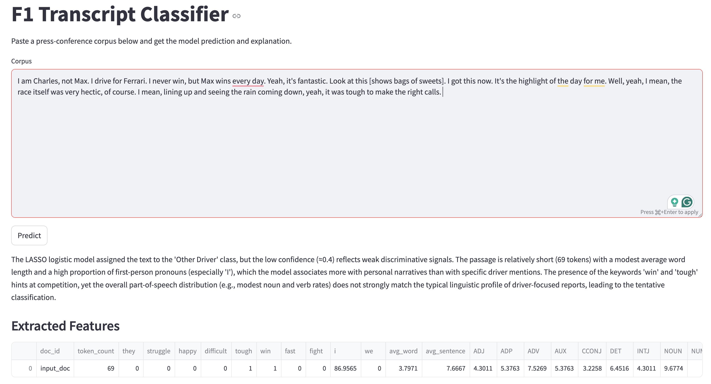

# Stylometric Profiling and Speaker Classification in Formula 1 Press Conferences

**Author:** Jiashen Wang  
**Date:** December 2025  

## Overview

This project analyzes linguistic patterns in **Formula 1 FIA press-conference transcripts (2022–2025)** to study how drivers differ in communication style and whether language alone can reliably identify individual speakers.

Using natural language processing (NLP) and statistical modeling, the project addresses three research questions:

1. How does **media presence** (token volume) change across seasons and drivers?
2. Do drivers exhibit **distinct linguistic styles** based on part-of-speech usage?
3. Can linguistic features **predict whether a transcript was spoken by Max Verstappen**?

The analysis combines descriptive statistics, hierarchical clustering, PCA, and **LASSO-regularized logistic regression**.  
The full academic report is available in this repository as `F1_Speaker_Classification.pdf`.

---

## Data

- **Source:** Official FIA Formula 1 press-conference transcripts (formula1.com)
- **Seasons:** 2022–2025
- **Document unit:** All remarks made by one driver in one press conference
- **Filtering:** Only transcripts with **≥ 200 tokens** retained

### Corpus Summary

| Year | Documents | Tokens |
|-----:|----------:|-------:|
| 2022 | 253 | 193,165 |
| 2023 | 285 | 240,316 |
| 2024 | 228 | 247,277 |
| 2025 | 282 | 266,716 |
| **Total** | **1,048** | **947,474** |

Each document is labeled with:
- Driver
- Team
- Season
- Grand Prix
- Press-conference type

---

## Methods

### 1. Media Presence Analysis
- Token counts aggregated by **driver × season**
- Analysis restricted to the **top seven drivers** by total token volume
- Used to evaluate how competitive performance relates to media exposure

### 2. Linguistic Style Analysis
- Transcripts concatenated by driver
- **UDPipe** used to extract Universal POS tags
- POS proportions normalized to remove speech-length effects
- **Hierarchical clustering (Ward’s D2)** and **PCA** applied to identify stylistic groupings

### 3. Speaker Classification
- Binary task: **Max Verstappen vs. all other drivers**
- Chronological split:
  - Train: 2022–2024
  - Validation: 20% of training data
  - Test: 2025 (held-out)
- Model: **LASSO logistic regression (glmnet, α = 1)**

#### Feature Set
- Token-level metrics (word count, average word length, average sentence length)
- Keyword indicators (`they`, `win`, `difficult`, `happy`, etc.)
- Pronoun usage (`I`, `we`)
- POS distribution percentages

---

## Results

- Token volume closely reflects **competitive relevance** and championship success
- POS-based clustering reveals meaningful stylistic groupings:
  - Rookie drivers cluster together
  - Spanish drivers cluster together
  - Recent world champions cluster together
- Classification performance:
  - **87.9% validation accuracy**
  - **85.8% test accuracy (2025)**

Key linguistic indicators of Verstappen’s speech include:
- Greater use of evaluative and outcome-focused terms
- Shorter average word length
- Lower reliance on particles and adjectives

## LLM Application
Building on the core analysis of linguistic patterns and speaker classification, 
I developed an end-to-end NLP application that operationalizes these insights 
into an interactive tool. The system analyzes Formula 1 press conference 
transcripts and predicts whether the speaker is Max Verstappen using a stylometric 
classification model. The workflow begins with collecting and preprocessing 
unstructured text data, followed by feature extraction using linguistic signals 
such as part-of-speech distributions, keyword indicators, and pronoun usage. 
A trained LASSO logistic regression model then produces a probabilistic prediction 
based on these features.

To enhance interpretability, I integrated a generative AI layer using an LLM, 
which translates structured model outputs into clear, natural-language explanations 
grounded in the underlying linguistic patterns. The system is deployed through 
a lightweight interface that allows users to input custom text and receive both 
predictions and explanations in real time. The screenshot below shows the final 
user interface and example output of the application.
